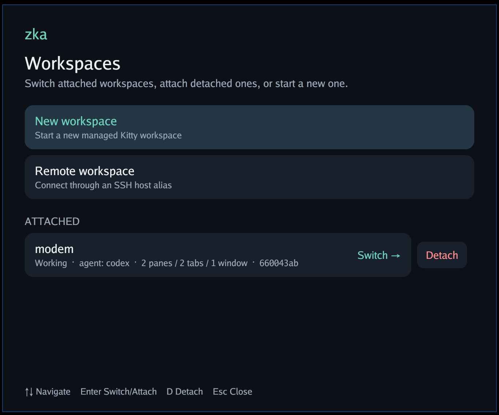
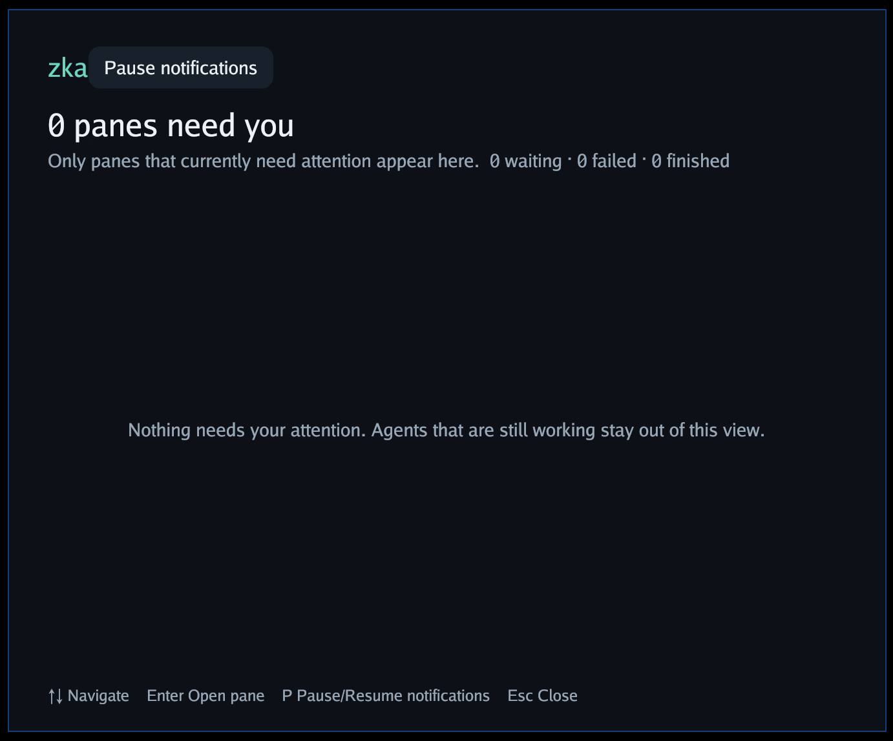

# zka

**Kitty-native workspaces that keep every terminal pane alive—locally, over
SSH, and across reconnects.**

`zka` turns a complete Kitty workspace—OS windows, tabs, splits, titles, working
directories, and focus—into one durable unit. Each pane runs in its own hidden
[`zmx`](https://github.com/neurosnap/zmx) session, so the shell, editor, server,
or coding agent inside it keeps running when the view goes away.

When Codex needs input or finishes work, zka collects the exact panes that need
you and takes you straight back to them.

<p align="center">
  
  
</p>

<p align="center">
  <em>Switch, attach, and detach complete workspaces. Then work from one live inbox instead of hunting through tabs.</em>
</p>

> [!NOTE]
> zka 0.6.0 is pre-1.0 software for NixOS on Linux/Wayland. It deliberately
> builds on Kitty, zmx, OpenSSH, systemd user services, and Codex hooks instead
> of replacing them.

[Quick start](#quick-start) · [Why zka](#why-zka) ·
[Compare](#how-zka-compares) · [How it works](#how-it-works) ·
[Remote workspaces](#remote-workspaces) · [Attention](#attention-and-notifications) ·
[Configuration](#configuration)

## Why zka

One long-running terminal is easy. Six coding agents across local and remote
machines are not: live processes are coupled to disposable windows, the session
you need is buried in a tab, and generic notifications do not tell you where to
go.

zka keeps the terminal workflow and adds the missing workspace layer:

| Capability | What it gives you |
| --- | --- |
| **Live process persistence** | Detach a workspace or lose Kitty/SSH without killing the programs inside its panes. |
| **Kitty-native UI** | Keep ordinary Kitty OS windows, tabs, splits, layouts, titles, scrollback, and key bindings. |
| **Whole-workspace restore** | Recreate the logical topology, working directories, and focus around the same live zmx sessions. |
| **Remote attach and move** | Open an origin workspace from another machine over normal OpenSSH, as a mirror or a primary handoff. |
| **Agent attention** | See Codex panes that are blocked, failed, or done in one live queue; jump directly to the exact pane. |
| **Composable infrastructure** | Keep network reachability, authentication, terminal rendering, and PTY ownership in tools that already do them well. |

zka is not a new terminal emulator or an outer multiplexer. It does not replay a
foreground command and hope it resumes correctly. The process is already alive:

```text
local view:   Kitty → zka → zmx → shell / editor / agent
remote view:  Kitty → zka → OpenSSH → zmx on the origin → live process
```

## How zka compares

The closest conceptual alternative is [herdr](https://github.com/ogulcancelik/herdr).
Both products start from the same observation: persistent panes are not enough
when several coding agents can need attention at once. They choose different
abstraction boundaries:

- **herdr is the multiplexer.** Its background server owns the terminal panes,
  and its client renders an agent-aware workspace inside your existing terminal.
  It is portable across Linux and macOS, detects many agents, manages Git
  worktrees, and exposes a broad orchestration API.
- **zka composes the workspace.** Kitty continues to own the visible windows,
  tabs, splits, rendering, and input; zmx owns one persistent PTY per pane; zka
  adds durable workspace identity, topology restore, remote attachments, and a
  Codex attention layer. It is deliberately NixOS-, Wayland-, and Kitty-native.

Choose herdr when you want one portable, self-contained, agent-aware terminal
multiplexer. Choose zka when Kitty itself is the workspace you want to preserve,
including its native topology and desktop integration, while arbitrary pane
processes remain alive independently behind it.

### The wider landscape

This table compares product boundaries, not just whether a README can claim a
feature. “Persistence” distinguishes a live PTY from reconstructing a layout or
resuming an agent through its own session mechanism.

| Project | Primary surface | Persistence model | Remote model | Agent and workspace model |
| --- | --- | --- | --- | --- |
| [tmux](https://github.com/tmux/tmux) | Terminal multiplexer | tmux server owns persistent PTYs | Run tmux on the remote host over SSH | General-purpose sessions, windows, and panes; no built-in agent awareness or worktrees |
| [Zellij](https://github.com/zellij-org/zellij) | Batteries-included terminal workspace | Zellij server owns persistent PTYs | Run on the remote host; also offers a web client | General-purpose panes, layouts, collaboration, and plugins; no built-in coding-agent lifecycle |
| [herdr](https://github.com/ogulcancelik/herdr) | Agent-aware multiplexer inside any terminal | Herdr server owns persistent PTYs; native agent-session restore covers full server restarts | Run remotely or use its SSH thin-client mode | Broad agent detection, attention state, direct attach, built-in worktrees, plugins, and orchestration API |
| [cmux](https://github.com/manaflow-ai/cmux) | Native Ghostty-based macOS terminal | Restores layout/metadata; supported agents can resume from captured session IDs, but arbitrary processes are not checkpointed | Creates SSH workspaces from the macOS app | Agent notifications, browser surfaces, automation, and customizable worktree workflows |
| [Superset](https://github.com/superset-sh/superset) | macOS desktop code editor | Persistent terminal sessions per workspace survive app restarts | Primarily local desktop workspaces | Worktree-isolated parallel agents, monitoring, diff review, editor, and PR workflow |
| [Claude Squad](https://github.com/smtg-ai/claude-squad) | Terminal session manager | tmux provides process persistence | Runs wherever its tmux host runs | Multi-agent profiles, one worktree per task, previews, diff review, and checkout workflow |
| [Vibe Kanban](https://github.com/BloopAI/vibe-kanban) | Kanban-style local web/desktop app | Manages agent execution inside task workspaces rather than acting as a general PTY multiplexer | Self-hosted/remote deployment model | Planning, worktree execution, browser preview, inline diff review, and PR flow; project is sunsetting |
| **zka** | Native Kitty windows, tabs, and splits plus a small launcher/inbox | One zmx-owned live PTY per pane; topology is restored around the same processes | OpenSSH mirror attachments and transactional primary moves between configured machines | Arbitrary terminal programs, Codex lifecycle attention, no built-in task planner, diff review, or worktree isolation |

Comparison checked against each project's public documentation in July 2026.
These tools overlap, but they optimize for different jobs: general multiplexing,
agent orchestration, worktree-based delivery, or preserving a native terminal
workspace as a durable cross-machine unit.

## Quick start

### 1. Add the NixOS module

Add zka to your flake inputs and import its module into the machines that will
create or display workspaces:

```nix
{
  inputs = {
    nixpkgs.url = "github:NixOS/nixpkgs/nixos-unstable";
    zka = {
      url = "github:xlfe/zka";
      inputs.nixpkgs.follows = "nixpkgs";
    };
    zmx.url = "github:neurosnap/zmx";
  };

  outputs = { nixpkgs, zka, zmx, ... }: {
    nixosConfigurations.my-host = nixpkgs.lib.nixosSystem {
      system = "x86_64-linux";
      modules = [
        zka.nixosModules.default
        ({ pkgs, ... }: {
          services.zka = {
            enable = true;
            shell.command = [ "fish" ];
            zmx.package = zmx.packages.${pkgs.stdenv.hostPlatform.system}.default;
          };
        })
      ];
    };
  };
}
```

Apply the configuration:

```sh
sudo nixos-rebuild switch --flake .#my-host
```

The module installs zka, Kitty, OpenSSH, the Kitty watcher, the Codex hooks, and
the `zkad` systemd user service. `zmx.package` supplies the persistent PTY
backend.

### 2. Open the launcher

```sh
zka launch
```

Choose **New workspace**, give it an optional name, and work in Kitty normally.
Every new tab or split automatically becomes a persistent zmx-backed pane.

Prefer the CLI? Start a workspace in the current directory:

```sh
zka kitty --name example-project --cwd "$PWD"
```

### 3. Detach and come back

Detach closes the Kitty view and deliberately leaves every pane running:

```sh
zka workspace detach example-project
zka workspace attach example-project
```

That is the core zka loop. `attach` restores the workspace around the original
live processes; it does not rerun `codex`, `nvim`, a dev server, or the shell.

## The daily workflow

1. Run `zka launch` and create or switch to a workspace.
2. Add Kitty tabs and splits as usual; each becomes a managed pane.
3. Start any terminal program. Codex gets agent-aware status through managed
   lifecycle hooks.
4. Detach when you want the view gone but the work to continue.
5. Open `zka attention show` when you want only the panes that need a decision.
6. Attach the same workspace locally, or from another configured host over SSH.

The launcher groups known workspaces into **Attached** and **Detached**. Selecting
an attached workspace switches to its existing Sway window; selecting a detached
one reconstructs its Kitty view. Each row shows workspace-level agent state,
detected agent processes, and pane/tab/window counts.

## How it works

```text
workspace "example-project" on devbox.example
├── saved Kitty topology: OS windows → tabs → splits
├── pane A → zmx session → live Codex process
├── pane B → zmx session → live editor
└── pane C → zmx session → live shell

attachments
├── devbox.example → dedicated Kitty instance (primary)
└── laptop.example → dedicated Kitty instance over SSH (mirror)
```

| Term | Meaning |
| --- | --- |
| **Workspace** | The durable unit: logical Kitty topology, panes, agent state, and attachment metadata. |
| **Pane** | One stable zka pane ID backed by one zmx-owned PTY. |
| **Origin** | The machine that owns the workspace state and zmx sessions. |
| **Attachment** | A dedicated Kitty view of a workspace on one machine. |
| **Primary** | The authoritative interactive attachment after a local start or successful move. |
| **Mirror** | An additional attachment created without revoking the primary. |

Kitty remains the visible interface. zmx remains the only persistent PTY owner.
OpenSSH provides authentication and transport. zka owns workspace identity,
topology capture, restoration, remote coordination, lifecycle, and attention.
There is no listening zka TCP service, PTY migration, or local zmx wrapped
around an SSH connection.

### Lifecycle semantics

The difference between closing and detaching is intentional:

| Action or failure | Result |
| --- | --- |
| Close a split or tab | Remove that pane and kill its zmx session. |
| Detach a workspace | Close only the local Kitty attachment; preserve all zmx sessions. |
| Attach a workspace | Focus the existing view or recreate it around the same sessions. |
| Confirm Kitty quit / close the final pane | Kill the workspace. |
| Kitty crash or lost control socket | Preserve the sessions and mark the attachment unhealthy. |
| Kill a workspace | Persist cleanup intent, terminate its zmx sessions, and retry partial cleanup durably. |
| One backend dies | Restore a removable `zmx backend is dead` placeholder while other panes survive. |
| Every backend dies | Close remaining managed views and reclaim the workspace. |

Restoration recreates the logical OS-window/tab/split hierarchy, layout state,
titles, working directories, and active focus. A watcher triggers topology
capture, with a two-second reconciliation fallback.

## Workspace commands

```sh
zka workspace list
zka workspace inspect example-project
zka workspace attach example-project
zka workspace move example-project
zka workspace focus example-project --pane PANE_ID
zka workspace seen example-project
zka workspace detach example-project
zka workspace rename example-project shell-work
zka workspace kill shell-work
```

`attach` and `move` are idempotent: repeating either command reuses the
deterministic machine/workspace attachment instead of creating duplicates.
`kill` is immediate and non-interactive.

Run `zka help`, `zka workspace help`, or a command with `--help` for the complete
CLI surface.

## Topology templates

Start a workspace from a topology-only Kitty session template:

```text
new_tab work
layout splits
launch --location default
launch --location vsplit
launch --location hsplit
launch --location hsplit
focus
```

```sh
zka kitty --name quad --template ./quad.kitty-session
```

Templates may contain topology directives and bare `launch` directives only.
Program-bearing launches, unknown directives, and the reserved `zka_workspace`,
`zka_pane`, or `ZKA_*` variables are rejected. zka adds stable pane IDs and
canonical attachment commands itself.

## Remote workspaces

Configure a normal OpenSSH host alias that resolves from the destination. The
origin and destination must run the same zka version, and `zkad` must be running
on the origin.

The graphical path is the same: choose **Remote workspace** in `zka launch`,
enter the SSH alias, and select an origin workspace. From the destination, the
CLI equivalents are:

```sh
zka workspace list --origin devbox.example
zka workspace inspect devbox.example:example-project
zka workspace attach devbox.example:example-project
zka workspace move devbox.example:example-project
zka workspace rename devbox.example:example-project shell-work
zka workspace kill devbox.example:shell-work
```

Use `attach` for a mirror. Use `move` to make the destination primary. A move is
a two-phase handoff:

1. Fetch origin revision R and register a preparing destination attachment.
2. Create every destination Kitty pane.
3. Require a fresh origin-side heartbeat from every SSH-to-zmx client.
4. Confirm the logical topology and focus.
5. Commit the primary lease at revision R.
6. Only then revoke and close the old primary views.

If Kitty creation, SSH, revision validation, or pane readiness fails, zka removes
the new view and leaves the source untouched.

### Remote reliability

The daemon keeps one supervised control connection per origin. Snapshot and
state events travel over a versioned, one-MiB-limited JSON-lines protocol inside
SSH; terminal traffic uses separate SSH channels that attach directly to zmx on
the origin.

OpenSSH server-alive checks detect dead connections. After a completed protocol
handshake, exit status 255 triggers exponential reconnect from 250 ms to 30
seconds and attachment to the same zmx session. Status 255 before the first
handshake is treated as an authentication or configuration failure. Mutating
handoff requests are replay-safe if SSH drops after the origin acts but before
the response arrives.

zka never restarts a missing foreground process. It reports the missing backend
explicitly while preserving the rest of the workspace.

## Attention and notifications

Each pane records explainable Codex lifecycle evidence and one of `unknown`,
`idle`, `working`, `blocked`, `done`, or `error`. The workspace exposes the
highest-priority aggregate. Managed hooks associate Codex events with the hidden
pane through `ZKA_WORKSPACE_ID` and `ZKA_PANE_ID`.

`zka attention` is a live projection of what needs you now, not a notification
history. Resolved items disappear automatically; finished work disappears while
that exact pane is focused. The queue shows blocked work first, then errors,
then completed work, oldest first within each state.

```sh
zka attention show             # graphical queue of actionable panes
zka attention status           # one human-readable snapshot
zka attention status --json    # versioned machine-readable snapshot
zka attention focus-next       # restore/focus the highest-priority exact pane
zka attention pause            # silence interruptions; agents keep running
zka attention resume
zka attention toggle
```

Kitty titles and local notifications reflect pane state. By default, zka sends
desktop and `ntfy-send` notifications for `blocked` and `error`, and for `done`
when the pane has no attached view. Delivery is deduplicated; failures remain
visible in `zka workspace inspect`.

Pause persists across daemon restarts. It suppresses locally generated desktop
and ntfy notifications while agents and remote synchronization continue. The
pending count stays visible, and resume delivers only items that still need
attention and were not delivered before. Pause and ntfy policy belong to each
origin; they are not propagated over SSH.

### Waybar and Sway

Waybar can hold one streaming subscription to `zkad`, with no polling interval
or process per update:

```jsonc
"custom/zka": {
  "exec": "zka attention watch --waybar",
  "return-type": "json",
  "restart-interval": 2,
  "format": "zka {text}",
  "tooltip": true,
  "on-click": "zka attention show",
  "on-click-middle": "zka attention focus-next",
  "on-click-right": "zka attention toggle"
}
```

The module always emits a count, including `0`, plus one of the CSS classes
`clear`, `blocked`, `error`, `done`, `paused`, or `unavailable`:

```css
#custom-zka { color: #99a8b8; }
#custom-zka.blocked, #custom-zka.error { color: #ff8f91; }
#custom-zka.done { color: #6ed5c0; }
#custom-zka.paused { color: #7b8794; }
#custom-zka.unavailable { color: #d2a8ff; }
```

Bind the launcher and inbox directly in Sway:

```text
bindsym $mod+Return exec zka launch
bindsym $mod+a exec zka attention show
bindsym $mod+Shift+a exec zka attention focus-next
bindsym $mod+Ctrl+a exec zka attention toggle

for_window [app_id="^zka-launch$"] floating enable, resize set width 680 px height 560 px, move position center
```

The launcher and attention popup share the stable Wayland app ID `zka-launch`.
The attention window title is `zka attention` if a compositor rule needs to
distinguish it. Up/Down selects, Enter or a click focuses the exact pane, `P`
pauses or resumes notifications, and Escape closes the popup.

## Configuration

The NixOS module owns the runtime configuration shared by the CLI, launcher, and
daemon:

```nix
services.zka = {
  enable = true;

  shell.command = [ "fish" ];
  zmx.package = zmx.packages.${pkgs.stdenv.hostPlatform.system}.default;

  attention.states = [ "blocked" "error" "done" ];
  kitty.extraArgs = [ "--class" "managed-kitty" ];

  ssh.identityAgent = "/run/user/%i/ssh-agent.socket";
  ssh.extraOptions = [ "-o" "IdentitiesOnly=yes" ];
  ssh.options = [
    "-o" "ServerAliveInterval=5"
    "-o" "ServerAliveCountMax=3"
    "-o" "BatchMode=yes"
  ];

  notifications = {
    desktopEnabled = true;
    ntfyEnabled = true;
    ntfyCommand = "ntfy-send";
  };

  # Add the package that provides your already-configured helper.
  # extraPackages = [ inputs.ntfy-send.packages.${pkgs.system}.default ];
};
```

When managed Codex hooks are enabled, the module owns
`/etc/codex/requirements.toml`. Add other system requirements under
`services.zka.codex.extraRequirements`; zka does not disable user or project
hooks.

`ntfy-send` authentication remains in the helper's own configuration. zka never
reads or transports its token.

## Advanced SSH setup

<details>
<summary><strong>Select the SSH agent used by zkad</strong></summary>

Control SSH runs inside `zkad`, so without an explicit `IdentityAgent` it
inherits the systemd user manager's environment, not necessarily the environment
of the shell that opened the launcher. Prefer a persistent socket:

```nix
services.zka.ssh.identityAgent = "/run/user/%i/ssh-agent.socket";
```

OpenSSH expands `%i` to the numeric user ID. This socket is also the default
agent inside new zka workspaces when managed forwarding is enabled.

Inspect the user manager's current environment with:

```sh
systemctl --user show-environment | rg '^SSH_AUTH_SOCK='
```

For a temporary, session-dependent workaround, import the interactive shell's
agent and restart the daemon:

```sh
systemctl --user import-environment SSH_AUTH_SOCK DISPLAY WAYLAND_DISPLAY
systemctl --user restart zkad
```

The default `BatchMode=yes` prevents password, host-key, and private-key
passphrase prompts. Any required confirmation must be available independently;
zka has no controlling terminal and does not relay prompts through the launcher.

`zka doctor --origin HOST` compares the effective daemon and caller agent
sockets, verifies them, lists SHA256 public-key fingerprints, and fails
`ssh-agent-match` when their identities differ. `journalctl --user-unit zkad`
contains the same bounded SSH diagnostic.

</details>

<details>
<summary><strong>Reuse SSH authentication across panes</strong></summary>

The control connection and remote panes are separate SSH sessions. OpenSSH
multiplexing carries them as independent channels over one authenticated network
connection:

```nix
services.zka.ssh.extraOptions = [
  "-o" "ControlMaster=auto"
  "-o" "ControlPersist=10m"
  "-o" "ControlPath=/run/user/%i/zka-ssh-%C"
];
```

Append these entries if `ssh.extraOptions` already contains options such as
`IdentitiesOnly=yes`. The first connection becomes the master; later control and
pane sessions reuse it without another key or hardware-token operation. `%C`
keeps each destination's socket name short and unique.

A connection failure interrupts all multiplexed channels together. zka's
control and pane reconnect paths then reattach them to the same zmx sessions.

</details>

<details>
<summary><strong>Forward an SSH agent into a persistent workspace</strong></summary>

Enable managed forwarding on the origin and every destination that will display
its workspaces:

```nix
services.zka.ssh.forwardAgent = true;
```

This enables `ForwardAgent=yes` for zka's SSH sessions and an origin-side relay
at a stable per-workspace path under `$XDG_RUNTIME_DIR/zka/agents`. Adding
`ForwardAgent=yes` only to `ssh.extraOptions` does not enable the relay.

New zmx backends receive that stable relay as `SSH_AUTH_SOCK`. Temporary sockets
from individual SSH connections are reported by pane heartbeats but never
persisted or printed, so replacing a pane channel or ControlMaster does not
change the shell's environment.

The relay uses the origin `zkad` agent until a destination attachment explicitly
claims the workspace:

```sh
zka workspace attach devbox.example:example-project
zka workspace agent claim devbox.example:example-project
zka workspace agent status devbox.example:example-project
```

Return to the origin agent with:

```sh
zka workspace agent release devbox.example:example-project
```

A claim is workspace-wide, persists across detach and daemon restart, and never
follows focus silently. The destination agent is usable only while that
attachment has a live pane SSH connection. After six seconds without a
heartbeat, the relay closes active agent connections and fails closed rather
than falling back to another agent.

Backends created before forwarding was enabled do not have the stable socket.
The claim command identifies those pane IDs; recreate those panes or the
workspace. Use `zka doctor --origin devbox.example` to verify both ends.

> [!CAUTION]
> Agent forwarding does not copy private keys, but processes on a compromised
> origin can request signatures while the connection is live. Use constrained
> or confirmation-requiring keys, claim only trusted workspaces, and release a
> claim when it is no longer needed.

</details>

<details>
<summary><strong>Use the local clipboard from remote Neovim</strong></summary>

`clipboard=unnamedplus` does not transport clipboard data between machines. In a
remote pane, a `wl-copy` provider runs on the origin. Kitty selection copying
works because the displaying Kitty process handles it locally.

For Neovim 0.10 or newer, select its built-in OSC 52 provider before anything
initializes the clipboard:

```lua
if vim.env.ZKA_WORKSPACE_ID then
  vim.g.clipboard = "osc52"
end

vim.opt.clipboard = "unnamedplus"
```

Do not test `SSH_CONNECTION`: Neovim can start in a local attachment and later
be viewed remotely because zmx preserves the process. Restart Neovim after
changing the provider.

Test the terminal path independently; the displaying machine's clipboard should
become `zka-osc52-test`:

```sh
printf '\033]52;c;emthLW9zYzUyLXRlc3Q=\a'
```

Kitty permits clipboard writes by default. Reading over OSC 52 may raise Kitty's
configured permission prompt; Kitty's normal paste binding avoids granting
remote programs unconditional clipboard-read access.

</details>

## Diagnostics

```sh
zka doctor
zka doctor --origin devbox.example
journalctl --user-unit zkad
```

`zka workspace inspect WORKSPACE` includes attachment health, pane/backend state,
agent evidence, and retained notification failures.

## Boundaries

"Exact restore" means logical Kitty topology plus the live terminal state still
owned by zmx. zka does not promise pixel-perfect compositor placement, migrate
terminal graphics, or adopt an ordinary already-running PTY. Managed workspaces
use dedicated Kitty instances so every view can be identified and restored
safely; shared unmanaged Kitty processes remain outside the model.

zka manages durable terminal workspaces, not prompts, branches, worktrees, diffs,
or agent task planning. Any terminal program can run in its panes, while the
built-in attention integration currently targets Codex lifecycle hooks.

Keep short-lived utility terminals on plain Kitty unless their processes should
persist. Existing `new_window_with_cwd` and `new_tab_with_cwd` mappings continue
to work: the managed instance uses Kitty's last OSC-7-reported directory before
routing the new pane through zka.

## Project status

Version 0.6.0 implements the complete workspace-centric path: local lifecycle,
topology restoration, remote mirrors and two-phase moves, reconnect-safe SSH
agent forwarding, Codex attention, Waybar streaming, desktop/ntfy notifications,
and durable cleanup after partial failures.

State schemas v1 and v2 are reset on the first v0.3-or-newer start because v3
changed process ownership. The reset removes old zka state and generated Kitty
sessions but does not kill old zmx sessions or signal existing Kitty processes.
Those zmx sessions remain as unmanaged orphans that can be inspected or removed
with zmx.

## Development

The flake supports `x86_64-linux` and `aarch64-linux`. Build the binaries and run
the NixOS module checks with:

```sh
nix flake check
```

The package check runs the Go test suite with the Wayland-only `nox11` build tag.
