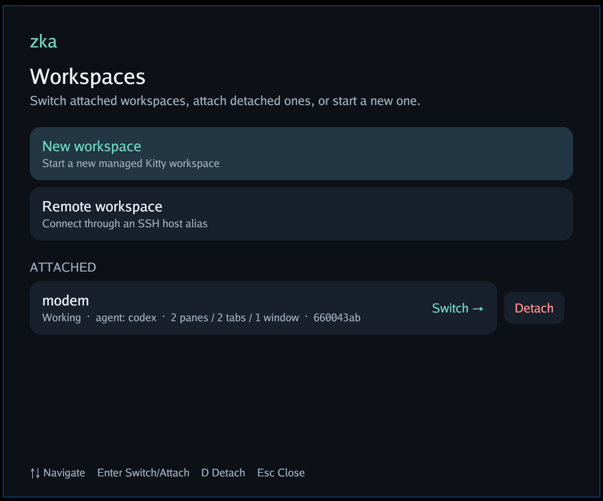
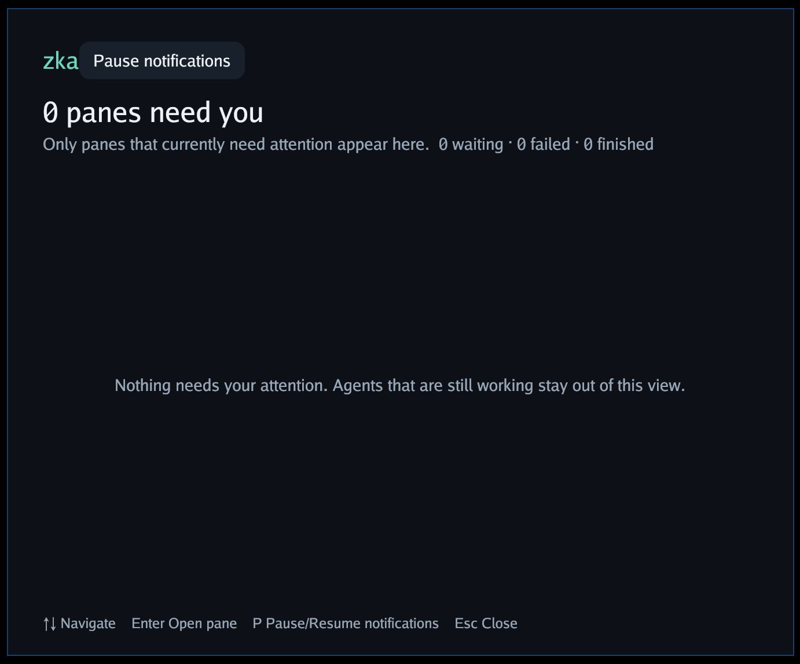

# zka

**Kitty-native durable terminal workspaces, agent attention, and scoped remote
credentials.**

`zka` turns a complete Kitty workspace—OS windows, tabs, splits, titles, working
directories, and focus—into one durable unit. Each pane runs in its own hidden
[`zmx`](https://github.com/neurosnap/zmx) session, so the shell, editor, server,
or coding agent inside it keeps running when the view goes away.

When Codex or Claude Code needs input or finishes work, zka collects the exact
panes that need you and takes you straight back to them. When a remote workspace
needs your local SSH agent or OpenPGP key, an explicit credential-bundle claim
projects stable endpoints into the origin workspace while keeping private keys
and provider socket paths on the provider.

<p align="center">
  
  
</p>

<p align="center">
  <em>Switch, attach, and detach complete workspaces. Then work from one live inbox instead of hunting through tabs.</em>
</p>

> [!NOTE]
> zka 0.9.1 is pre-1.0 software for NixOS on Linux/Wayland. It deliberately
> builds on Kitty, zmx, OpenSSH, systemd user services, and coding-agent hooks
> instead of replacing them.

[Quick start](#quick-start) · [Why zka](#why-zka) ·
[Compare](#how-zka-compares) · [How it works](#how-it-works) ·
[Remote workspaces](#remote-workspaces) · [Credentials](#credential-bundles) ·
[Security](#security-model) · [Attention](#attention-and-notifications) ·
[Configuration](#configuration)

## Why zka

One long-running terminal is easy. Six coding agents across local and remote
machines are not: live processes are coupled to disposable windows, the session
you need is buried in a tab, generic notifications do not tell you where to go,
and a remote agent may need a local hardware-backed identity without receiving
the private key.

zka keeps the terminal workflow and adds the missing workspace layer:

| Capability | What it gives you |
| --- | --- |
| **Live process persistence** | Detach a workspace or lose Kitty/SSH without killing the programs inside its panes. |
| **Kitty-native UI** | Keep ordinary Kitty OS windows, tabs, splits, layouts, titles, scrollback, and key bindings. |
| **Whole-workspace restore** | Recreate the logical topology, working directories, and focus around the same live zmx sessions. |
| **Remote attach and move** | Open an origin workspace from another machine over normal OpenSSH, as a mirror or a primary handoff. |
| **Agent attention** | See Codex and Claude Code panes that are blocked, failed, or done in one live queue; jump directly to the exact pane. |
| **Credential bundles** | Explicitly claim and release stable SSH-agent and filtered OpenPGP capabilities for a remote workspace, across reconnects. |
| **Headless origins** | Keep workspaces, hooks, notifications, and credential targets alive on a machine with no Kitty or graphical session. |
| **Composable infrastructure** | Keep network reachability, authentication, terminal rendering, and PTY ownership in tools that already do them well. |

zka is not a new terminal emulator or an outer multiplexer. It does not replay a
foreground command and hope it resumes correctly. The process is already alive:

```text
local view:    Kitty → zka → zmx → shell / editor / agent
remote view:   Kitty → zka → OpenSSH → zmx on the origin → live process
credential:    origin process → workspace socket → zka/yamux/OpenSSH
                 → provider SSH agent or filtered gpg-agent → YubiKey
```

## How zka compares

The closest conceptual alternative is [herdr](https://github.com/ogulcancelik/herdr).
Both products start from the same observation: persistent panes are not enough
when several coding agents can need attention at once. They choose different
abstraction boundaries:

- **herdr is the multiplexer.** Its background server owns the terminal panes,
  and its client renders an agent-aware workspace inside your existing terminal.
  It is portable across Linux and macOS, detects many agents, manages Git
  worktrees, and exposes a broad orchestration API.
- **zka composes the workspace.** Kitty continues to own the visible windows,
  tabs, splits, rendering, and input; zmx owns one persistent PTY per pane; zka
  adds durable workspace identity, topology restore, remote attachments, and a
  Codex and Claude Code attention layer. It is deliberately NixOS-, Wayland-,
  and Kitty-native.

Choose herdr when you want one portable, self-contained, agent-aware terminal
multiplexer. Choose zka when Kitty itself is the workspace you want to preserve,
including its native topology and desktop integration, while arbitrary pane
processes remain alive independently behind it.

### The wider landscape

This table compares product boundaries, not just whether a README can claim a
feature. “Persistence” distinguishes a live PTY from reconstructing a layout or
resuming an agent through its own session mechanism. The credential column says
what the product documents; an underlying shell or SSH setup can always add
other credential plumbing independently.

| Project | Surface and persistence | Remote model | Agent and workspace model | Documented credential model |
| --- | --- | --- | --- | --- |
| [tmux](https://github.com/tmux/tmux) | Multiplexer in any terminal; the tmux server owns live PTYs | Run tmux on the remote host over SSH | General sessions, windows, and panes; scriptable but not agent-semantic | [Inherits and refreshes](https://github.com/tmux/tmux/wiki/FAQ#how-do-i-use-ssh-agent1-with-tmux) environment such as `SSH_AUTH_SOCK`; forwarding policy belongs to SSH |
| [Zellij](https://github.com/zellij-org/zellij) | Batteries-included multiplexer; the Zellij server owns live PTYs | Run remotely, or [attach from a browser or terminal](https://zellij.dev/documentation/web-client.html) over authenticated HTTPS | General panes, layouts, collaboration, plugins, and programmatic control | Uses the session host's environment; no product-level credential-claim model is documented |
| [herdr](https://github.com/ogulcancelik/herdr) | Agent-aware multiplexer in any terminal; its server owns live PTYs | Run remotely or use its SSH thin client | Broad agent detection, direct attach, worktrees, plugins, and an orchestration API | Uses the session host's environment; no product-level credential-claim model is documented |
| [cmux](https://github.com/manaflow-ai/cmux) | Native Ghostty-based macOS terminal; restores app topology, scrollback, and supported sessions | [Durable SSH workspaces](https://cmux.com/docs/ssh) reconnect to a remote relay/tmux session | Agent notifications, native subagent panes, browser surfaces, files, and automation | [`cmux ssh` forwards](https://cmux.com/docs/changelog) the local SSH agent into the remote workspace |
| [Superset](https://github.com/superset-sh/superset) | macOS editor/CLI/MCP with persistent terminals per Git worktree | Primarily local desktop workspaces | Parallel agents, monitoring, diff review, editor, PR flow, and worktree isolation | Uses credentials available to the local workspace; no remote-forwarding model is documented |
| [Claude Squad](https://github.com/smtg-ai/claude-squad) | Terminal manager using tmux for live process persistence | Runs wherever its tmux host runs | Multiple agent profiles, one worktree per task, preview, diff, and checkout workflow | Uses credentials available in its tmux host environment |
| [Vibe Kanban](https://github.com/BloopAI/vibe-kanban) | Kanban web/desktop task runner rather than a general PTY multiplexer | Self-hosted deployment model | Planning, worktree execution, browser preview, diff review, and PR flow; [the project is sunsetting](https://www.vibekanban.com/blog/shutdown) | Uses credentials available to the task host; no workspace forwarding model is documented |
| **zka** | Native Kitty windows, tabs, and splits; one zmx-owned live PTY per pane | OpenSSH mirrors, transactional primary moves, and reconnecting headless origins | Arbitrary terminal programs plus Codex/Claude lifecycle attention; no task planner, diff review, or worktree isolation | Explicit workspace claims for a selected whole SSH agent and fingerprint/keygrip-filtered OpenPGP signing or decryption |

Comparison checked against each project's primary public documentation in
August 2026. These tools optimize for different jobs: general multiplexing,
agent orchestration, worktree-based delivery, native terminal restoration, or
controlled access from remote workspaces to provider-held credentials.

Conventional [OpenSSH agent forwarding](https://man.openbsd.org/ssh_config#ForwardAgent)
gives the remote host use of every key offered by the forwarded agent for the
life of that connection. GnuPG's
[`agent-extra-socket`](https://wiki.gnupg.org/AgentForwarding) similarly keeps
private keys local and permits remote signing/decryption, but leaves public-key
distribution, socket placement, reconnects, and ownership to the operator. zka
does not make its SSH byte proxy key-selective. It adds an explicit durable
workspace claim, stable reconnecting endpoints, a separate keygrip-enforcing
OpenPGP filter, provider-side use notices, and credential-aware status/doctor
checks.

## Quick start

### 1. Add the NixOS module

Add zka to your flake inputs and import its module into the machines that will
create or display workspaces:

```nix
{
  inputs = {
    nixpkgs.url = "github:NixOS/nixpkgs/nixos-unstable";
    zka = {
      url = "github:xlfe/zka";
      inputs.nixpkgs.follows = "nixpkgs";
    };
    zmx.url = "github:neurosnap/zmx";
  };

  outputs = { nixpkgs, zka, zmx, ... }: {
    nixosConfigurations.my-host = nixpkgs.lib.nixosSystem {
      system = "x86_64-linux";
      modules = [
        zka.nixosModules.default
        ({ pkgs, ... }: {
          services.zka = {
            enable = true;
            shell.command = [ "fish" ];
            zmx.package = zmx.packages.${pkgs.stdenv.hostPlatform.system}.default;
          };
        })
      ];
    };
  };
}
```

Apply the configuration:

```fish
sudo nixos-rebuild switch --flake .#my-host
```

The module installs zka, Kitty, OpenSSH, the Kitty watcher, managed Codex and
Claude Code hooks, and the `zkad` systemd user service. `zmx.package` supplies
the persistent PTY backend. Install the Codex and Claude Code CLIs separately on
machines where you use them.

### 2. Open the launcher

```fish
zka launch
```

Choose **New workspace**, give it an optional name, and work in Kitty normally.
Every new tab or split automatically becomes a persistent zmx-backed pane.

Prefer the CLI? Start a workspace in the current directory:

```fish
zka kitty --name example-project --cwd "$PWD"
```

### 3. Detach and come back

Detach closes the Kitty view and deliberately leaves every pane running:

```fish
zka workspace detach example-project
zka workspace attach example-project
```

That is the core zka loop. `attach` restores the workspace around the original
live processes; it does not rerun `codex`, `claude`, `nvim`, a dev server, or
the shell.

## The daily workflow

1. Run `zka launch` and create or switch to a workspace.
2. Add Kitty tabs and splits as usual; each becomes a managed pane.
3. Start any terminal program. Codex and Claude Code get agent-aware status
   through managed lifecycle hooks.
4. Detach when you want the view gone but the work to continue.
5. Open `zka attention show` when you want only the panes that need a decision.
6. Attach the same workspace locally, or from another configured host over SSH.
7. Claim a credential bundle only when that trusted remote workspace needs it,
   then release the claim when the operation is complete.

The launcher groups known workspaces into **Attached** and **Detached**. Selecting
an attached workspace switches to its existing Sway window; selecting a detached
one reconstructs its Kitty view. Each row shows workspace-level agent state,
hook-reported agent types, and pane/tab/window counts.

## How it works

```text
workspace "example-project" on devbox.example
├── saved Kitty topology: OS windows → tabs → splits
├── pane A → zmx session → live Codex or Claude Code process
├── pane B → zmx session → live editor
└── pane C → zmx session → live shell

attachments
├── devbox.example → dedicated Kitty instance (primary)
└── laptop.example → dedicated Kitty instance over SSH (mirror)

optional credential claim owned by laptop.example
├── origin SSH_AUTH_SOCK → yamux stream → provider's selected SSH agent
├── origin GNUPGHOME   → yamux stream → provider's filtered gpg-agent
└── workspace PIVB socket → semantic mint stream → provider's networkless pivbd
```

| Term | Meaning |
| --- | --- |
| **Workspace** | The durable unit: logical Kitty topology, panes, agent state, and attachment metadata. |
| **Pane** | One stable zka pane ID backed by one zmx-owned PTY. |
| **Origin** | The machine that owns the workspace state and zmx sessions. |
| **Provider** | The attachment machine that owns the local agent or hardware token backing a claimed credential bundle. |
| **Attachment** | A dedicated Kitty view of a workspace on one machine. |
| **Primary** | The attachment that owns the interactive primary lease after a local start or successful move. |
| **Mirror** | An additional fully interactive attachment created without revoking the primary. |

Kitty remains the visible interface. zmx remains the only persistent PTY owner.
OpenSSH provides authentication and transport. zka owns workspace identity,
topology capture, restoration, remote coordination, lifecycle, attention, and
credential claims. There is no listening zka TCP service, PTY migration, or
local zmx wrapped around an SSH connection.

The origin owns one canonical, generation-numbered topology. Tabs, splits,
ordering, layouts, and tab titles changed in any ready attachment are committed
at the origin and reconciled into every other connected attachment. Focus,
scroll position, viewport size, and compositor geometry remain local so using a
mirror does not steal focus on another machine. Disconnected attachments catch
up from their last verified generation when they reconnect.

### Lifecycle semantics

The difference between closing and detaching is intentional:

| Action or failure | Result |
| --- | --- |
| Close a split or tab | Remove that pane and kill its zmx session. |
| Detach a workspace | Close only the local Kitty attachment; preserve all zmx sessions. |
| Attach a workspace | Focus the existing view or recreate it around the same sessions. |
| Confirm Kitty quit / close the final pane (workspace owned by this machine) | Kill the workspace. |
| Confirm Kitty quit / tear down the whole view (remote workspace attached here) | Detach only this attachment; the origin's zmx sessions and other attachments survive. Kill explicitly with `zka workspace kill`. |
| Kitty crash or lost control socket | Preserve the sessions and mark the attachment unhealthy. |
| Kill a workspace | Persist cleanup intent, terminate its zmx sessions, and retry partial cleanup durably. |
| Forget a detached remote workspace | Remove only this machine's cached metadata and generated Kitty sessions. The origin workspace and its processes survive and may reappear after a later reconnect. |
| One backend dies | Restore a removable `zmx backend is dead` placeholder while other panes survive. |
| Every backend dies | Close remaining managed views and reclaim the workspace. |

Restoration recreates the logical OS-window/tab/split hierarchy, layout state,
titles, working directories, and active focus. A watcher triggers topology
capture and origin-pushed reconciliation, with a 30-second liveness fallback.

## Workspace commands

```fish
zka workspace list
zka workspace inspect example-project
zka workspace reconcile example-project
zka workspace create api --template ./quad.kitty-session
zka workspace create devbox.example:api --attach
zka workspace attach example-project
zka workspace move example-project
zka workspace focus example-project --pane PANE_ID
zka workspace seen example-project
zka workspace detach example-project
zka workspace forget devbox.example:example-project
zka workspace rename example-project shell-work
zka workspace kill shell-work
```

`attach` and `move` are idempotent: repeating either command reuses the
deterministic machine/workspace attachment instead of creating duplicates.
`kill` is immediate and non-interactive.

`forget` is the local-only cleanup for a cached remote workspace. Every local
attachment must already be detached. An `SSH_ALIAS:` qualifier selects the
matching entry in the local cache; the command does not open SSH, change SSH
agent ownership, or stop anything on the origin. Reconnecting to that origin
can discover and cache the workspace again. Use `kill` when you intend to
destroy the authoritative workspace and its live processes.

`create` births a workspace without launching Kitty, locally or on a remote
origin (`SSH_ALIAS:NAME`; `SSH_ALIAS:` lets the origin pick a name). The
workspace comes out **dormant** — fully attachable, with no view anywhere and
no processes started — and stays that way until something attaches; `list`
shows the state as `dormant`. Pane directories default to the origin's home;
an explicit `--cwd` must be absolute for a remote origin. With `--attach` the
standard attach follows immediately and this machine becomes the primary.
Creation is replay-safe over SSH: retrying after a dropped connection returns
the workspace that was already born instead of creating a duplicate.

Run `zka help`, `zka workspace help`, or a command with `--help` for the complete
CLI surface.

## Topology templates

Start a workspace from a topology-only Kitty session template:

```text
new_tab work
layout splits
launch --location default
launch --location vsplit
launch --location hsplit
launch --location hsplit
focus
```

```fish
zka kitty --name quad --template ./quad.kitty-session
```

Templates may contain topology directives and bare `launch` directives only.
Program-bearing launches, unknown directives, and the reserved `zka_workspace`,
`zka_pane`, or `ZKA_*` variables are rejected. zka adds stable pane IDs and
canonical attachment commands itself.

## Remote workspaces

Configure a normal OpenSSH host alias that resolves from the destination. The
origin and destination must run the same zka version, and `zkad` must be running
on the origin.

The graphical path is the same: choose **Remote workspace** in `zka launch`,
enter the SSH alias, and select an origin workspace — or pick **New workspace
on \<host\>** to create one on the origin and attach it here in one step. From
the destination, the CLI equivalents are:

```fish
zka workspace list --origin devbox.example
zka workspace inspect devbox.example:example-project
zka workspace create devbox.example:api --attach
zka workspace attach devbox.example:example-project
zka workspace move devbox.example:example-project
zka workspace forget devbox.example:example-project
zka workspace rename devbox.example:example-project shell-work
zka workspace kill devbox.example:shell-work
```

Use `attach` for a mirror. Use `move` to make the destination primary. A move is
a two-phase handoff:

1. Fetch origin revision R and register a preparing destination attachment.
2. Create every destination Kitty pane.
3. Require a fresh origin-side heartbeat from every SSH-to-zmx client.
4. Confirm the logical topology and focus.
5. Commit the primary lease at revision R.
6. Only then revoke and close the old primary views.

If Kitty creation, SSH, revision validation, or pane readiness fails, zka removes
the new view and leaves the source untouched.

### Remote reliability

The daemon keeps one supervised `ssh -T` control process per origin. Its stdio
is a yamux session: a reserved stream carries the versioned,
one-MiB-limited JSON-lines control protocol, and independent streams carry
credential connections. Terminal traffic remains on separate SSH channels that
attach directly to zmx on the origin.

OpenSSH server-alive checks detect dead connections. Transient startup,
transport, and handshake failures retry with jittered exponential backoff capped
at 30 seconds. Authentication or host-key rejection, a missing local `ssh` or
remote `zka`, protocol incompatibility, and credential node-pin failures stop
that supervisor with an explicit diagnostic. Pane channels reconnect
independently and reattach to the same zmx sessions. Mutating handoff requests
are replay-safe if SSH drops after the origin acts but before the response
arrives.

zka never restarts a missing foreground process. It reports the missing backend
explicitly while preserving the rest of the workspace.

## Credential bundles

Credential bundles let an attachment machine act as a **provider** for a
persistent workspace on another **origin**. A bundle names semantic
capabilities; the current protocol implements three:

- **SSH agent:** a byte proxy to the provider's selected agent. The claim is
  workspace-scoped, but the protocol is intentionally not key-filtered: every
  identity offered by that agent is available through the endpoint.
- **OpenPGP:** signing and decryption through the provider's restricted
  `gpg-agent` extra socket. Configured fingerprints are resolved to keygrips on
  the provider and enforced by an Assuan-aware default-deny filter.
- **PIVB:** a constrained subject-token mint request to a provider-side,
  networkless `pivbd`. ZKA never forwards PC/SC, APDUs, PINs, control sockets,
  or arbitrary RSA digests. The bundle allowlists aliases and each claim pins
  the live card's serial, JWK key ID, and public key.

This is a breaking replacement for the old workspace-agent relay. Remove
`services.zka.ssh.forwardAgent` and any `ForwardAgent=yes` or `-A` option across
the fleet; zka rejects them rather than running two credential paths.

Define the bundle on both machines. Only the provider carries the authorized
OpenPGP fingerprints:

```nix
# Shared by laptop (provider) and devbox (origin).
services.zka.credentials = {
  defaultBundle = "work"; # selected only by an explicit create/attach claim
  # Protocol 1 is cooperative. Enforced provenance is not yet available.
  pivb.routingMode = "environment";
  bundles.work = {
    sshAgent.enable = true;
    openpgp.enable = true;
    pivb = {
      enable = true;
      aliases = [ "ro" "deploy" ];
    };
  };
};

# laptop only: authorize the keys this provider may expose.
services.zka.credentials.bundles.work.openpgp.signingKeys = [
  "1111222233334444555566667777888899990000"
];
```

> [!IMPORTANT]
> The v0.8.0 instructions required this shared configuration but v0.8.0 also
> projected managed credential paths into every newly created local pane on the
> provider. Anyone who followed those instructions can have affected panes:
> local Git push and SSH fail because `SSH_AUTH_SOCK` names an absent relay,
> while GPG sees an empty managed keyring with agent autostart disabled. Upgrade
> to this release on the whole fleet and follow the migration steps below.

Pin the two zka nodes before claiming credentials. `zka doctor` prints the
local `node=` value. On `laptop`, bind the outbound SSH alias to `devbox`'s
node; on `devbox`, allow `laptop`'s node ID to provide credentials:

```nix
# laptop
services.zka.ssh.expectedNodeIDs.devbox =
  "0123456789abcdef0123456789abcdef"; # devbox's node ID

# devbox
services.zka.credentials.providers.laptop = {
  nodeID = "fedcba9876543210fedcba9876543210"; # laptop's node ID
  # Optional for fixed hosts; omit this for roaming providers.
  # sshSourceAddresses = [ "192.0.2.10" ]; # exact IPs or CIDRs
};
```

`sshSourceAddresses` is empty by default so a VPN lease change, tethering, or
travel does not require rebuilding the origin. When present it is an additional
constraint derived from sshd's `SSH_CONNECTION`, not a replacement for the
mandatory node-ID allowlist. Do not use a wildcard such as `0.0.0.0/0`: that is
equivalent to omitting the address check, but misleadingly looks restrictive.

On the provider, zka can opt in to configuring the globally shared user
`gpg-agent`, its restricted extra socket, and graphical pinentry:

```nix
services.zka.credentials.gnupg = {
  configureAgent = true;
  pinentryPackage = pkgs.pinentry-gnome3;
  operationTimeout = "45s";
};
```

Leave `configureAgent = false` on the origin. If another module already owns a
suitable provider agent, extra socket, and pinentry, leave it false there too.
The setting is deliberately opt-in because the user agent is shared with every
other smart-card consumer in that session.

The pinentry itself should be graphical (GTK, Qt, GNOME, or another
display/session-bus implementation). zka does not bind pinentry to the pane's
terminal: before workspace creation or an explicit credential claim, the CLI
asks the local zkad to refresh the provider agent from the CLI peer's live
graphical session. It queries GnuPG's current `std_env_names`, carries
`LC_CTYPE` and `LC_MESSAGES` separately, and deliberately drops `GPG_TTY`,
`TERM`, and `INSIDE_EMACS`. The refresh runs without a controlling terminal and
has one eight-second budget across discovery, environment query, and
`UPDATESTARTUPTTY`. Failure is printed as a warning and does not turn a
credential claim into an availability failure.

The peer environment comes from the same-UID Unix client process, guarded by
`SO_PEERPIDFD`; this requires Linux 6.5 or newer. A relative
`WAYLAND_DISPLAY` is checked against that peer's `XDG_RUNTIME_DIR`. zka assumes
the provider gpg-agent belongs to the same user session and therefore resolves
the same per-user runtime directory when pinentry starts. A reachable peer
session wins over zkad's captured startup session, which is only a fallback for
stale or incomplete callers. X11 candidates must use an empty, `unix`, or
`localhost` display host and must resolve to a live local X socket; remote
display hostnames are never installed into the provider agent.

`UPDATESTARTUPTTY` replaces the user gpg-agent's startup environment globally,
so this affects every restricted consumer of that agent, not only zka. The
filtered OpenPGP route relies on this: restricted agent connections copy the
startup environment when they open and reject attempts to override it with
session `OPTION`s. To undo a bad refresh, first run the action again from the
correct graphical session. A code rollback alone does not restore the replaced
agent state; restart it if necessary:

```fish
gpgconf --kill gpg-agent
```

On a headless node, zka skips the refresh. `zka doctor` fails
`pinentry-session` when that node is configured or currently active as an
OpenPGP provider, or when its selected SSH source is gpg-agent, because a
graphical prompt can never be delivered there.

New workspaces default to the credential bundle of the machine creating them.
For a local create, the origin node binds its local bundle. For a remote create,
the machine driving zka binds its bundle on the remote origin before attaching:

```fish
zka kitty --name local-project
zka workspace create devbox:new-project --attach
zka workspace create devbox:public-project --attach --no-credentials
```

`defaultBundle` supplies the creation default and the name used when `--bundle`
is omitted. `--credential-bundle` overrides it; `--no-credentials` creates an
unclaimed workspace whose managed endpoints fail closed. It does not restore
ambient `SSH_AUTH_SOCK` or `GNUPGHOME` inside the pane.

For remote creation the graphical-session refresh still targets the local
daemon, because that machine owns both the provider and the CLI peer; only the
prepared credential bundle is claimed by the remote workspace. Attaching an
existing workspace without an explicit claim performs no refresh and does not
change its provider.

Attaching an existing workspace never changes its provider automatically. Use
an explicit claim when the attaching machine should take over the whole bundle:

```fish
zka workspace attach devbox:example-project
zka workspace attach devbox:example-project --claim-credentials --credential-bundle work
zka workspace credentials status --json devbox:example-project
```

A binding is workspace-wide and has exactly one controlling attachment. The
attachment must be ready, authenticated by the control path, and belong to the
provider node. Detaching that owning view releases the whole bundle and advances
the durable generation; detaching any other view leaves it unchanged. Explicit
release and workspace deletion have the same fail-closed effect:

This deliberately reverses the short-lived node-owned schema-9 model. Node
ownership made a confirmed detach indistinguishable from a temporary transport
loss, so a reconnect loop could retain or resurrect authority after the user
closed the controlling view. Attachment ownership preserves reconnect across a
dropped control connection while giving confirmed detach a durable revocation
event.

```fish
zka workspace credentials release devbox:example-project
```

A transient control disconnect retains both the durable binding and the stable
origin endpoints, reports remote capabilities as degraded, and fails new
operations closed. Reconnection replaces only the private provider transport;
panes and zmx backends keep using the same paths.

PIVB, SSH-agent, and OpenPGP move as one bundle. A remote claim atomically
replaces an active local provider. Release leaves every stable workspace
endpoint unavailable; it never falls back to a local card. A trusted local
launcher may explicitly and idempotently activate the origin bundle when the
workspace is unclaimed:

```fish
zka workspace credentials activate-local --if-unclaimed --bundle work example-project
set pivb_route (zka workspace credentials endpoint example-project)
pivb agent-session \
  --route-socket "$pivb_route" \
  --alias ro \
  --source-label codex:agentic/ro \
  -- sbx codex
```

The bare `endpoint` command exits nonzero for an unclaimed or degraded route;
use `endpoint --json` when inspecting route state rather than launching an
agent session.

The endpoint path and daemon-owned listener stay fixed for the workspace.
Provider changes replace the route behind it, so an already-running fixed-alias
sandbox can use a newly claimed provider without receiving a new socket or
broader authority. The
claim pins the live slot-9c serial, JWK key ID, and SPKI; a different card
requires a new explicit claim or local activation. Before takeover, the origin
also checks the remote provider, issuer, alias targets, and serial/key ID against
its card-free PIVB policy. On every successful mint the origin relay binds the
response to that active route pin, which origin-side pivbd verifies alongside
the signed token and local enrollment. See
[PIVB credential bundles](docs/pivb-credential-bundles.md) for the launcher,
PIVB service, timeout, and smart-card lease contract.

The credential environment is fixed when the zmx backend is created, not when a
view attaches or a provider changes. Every new local or remote pane receives the
same stable workspace `SSH_AUTH_SOCK`, `GNUPGHOME`, and—when any configured
bundle enables PIVB—the exact cooperative attachment tuple:

```text
PIVB_ATTACHMENT_MODE=route-required
PIVB_ROUTE_SOCKET=/absolute/stable/workspace/socket
PIVB_ATTACHMENT_PROTOCOL=1
```

`pivb capabilities --format=json` is checked against both zkad's configured
binary and the `pivb` resolved from the launching user's `PATH` before a backend
is started. A partial tuple, stale binary, unknown protocol, conflicting route,
or failed route is rejected without trying the origin-local card. An unclaimed or
disconnected route fails closed; a local binding routes those paths to the
origin provider, and an explicit remote claim transfers them without recreating
the pane, zmx backend, sandbox, or attachment.

Enforced attachment provenance remains a separate Stage 2. A cgroup is not an
authenticator in a delegated user subtree: a same-UID process can write its PID
to another pane scope's `cgroup.procs` and impersonate that workspace. An
inherited descriptor would provide a second factor, but the target-host probes
ran [zmx 0.6.0](https://github.com/neurosnap/zmx/blob/v0.6.0/src/main.zig#L817-L825),
which closes inherited descriptors 3 through 63 before spawning the PTY child.
Stage 2 therefore requires either an explicit zmx pass-descriptor contract or
process isolation that removes the same-UID control surfaces. ZKA does not
expose a `cgroup-bound` mode that would overstate this boundary.

If a remote provider daemon restarts without an explicit
`ssh.identityAgent`, SSH becomes degraded until the bundle is re-claimed rather
than silently switching agents.

Endpoint projection intentionally uses the union of capabilities in every
configured bundle, not only the currently claimed bundle. This pre-creates
stable paths so a later claim can activate them without replacing the backend.
For example, an SSH-only claim can still have an empty, fail-closed `GNUPGHOME`
when another configured bundle enables OpenPGP.

Inside a pane with the managed `GNUPGHOME`, `gpg --list-keys` intentionally
shows only the bundle's imported public keys and `gpg --list-secret-keys` shows
no local secret keys. The normal keyring is unchanged; unset `GNUPGHOME` (or use
an explicit `--homedir`) when you want to inspect it. This is isolation, not
keyring data loss.

### Recreating managed credential backends

After upgrading and restarting zka across the fleet, inventory pane
environments:

```fish
zka doctor
zka workspace credentials status --json
```

Environment version 5 is protocol 1. Any other live version is route-unsafe.
Ordinary `workspace reconcile`
remains a non-destructive topology recapture/backend census; it never terminates
a pane. Recreate only after reviewing the named panes:

```fish
zka workspace reconcile --recreate-backends example-project
```

The explicit operation requires an existing attachment-owned ready claim,
checks the configured and pane-visible PIVB capabilities, verifies stable
listeners and detached `zmx run`, then replaces the complete affected backend.
It never claims `defaultBundle` implicitly. This terminates programs in the
named panes. Durable pending state makes interruption retryable, while a failed
preflight leaves the old backend running. Until every live backend reports the
exact selected version, endpoint status is degraded and PIVB minting is
unavailable.

Schema 9 to 10 deliberately clears every credential claim—including cached
remote copies—because schema 9 did not retain an attachment owner. Every
workspace therefore requires a manual claim from a ready attachment after the
upgrade. Each upgrade attempt writes a new private
`.v9.<timestamp>.<nonce>.backup`; backups are never reused across an
upgrade/rollback/upgrade cycle. Zkad logs each exact backup path. Backups are
retained rather than pruned automatically; remove obsolete copies only after
the rollback window has closed.

For each OpenPGP private-key operation, the provider must have an interactive
session, must not report a positive screen lock, and must successfully deliver a
credential-use notice to the desktop service or mandatory `ntfy-send` fallback.
That fallback is a security path and ignores `notifications.ntfyEnabled`; if
neither channel accepts the notice, the operation fails closed. The operation
then remains bounded by `operationTimeout`. See
[Security model](#security-model) for what these checks do—and do not—authorize.

Git reports the outer failure as `gpg failed to sign the data`; the useful clue
is the Assuan error immediately above it:

| gpg/Assuan symptom | What zka rejected | What to check |
| --- | --- | --- |
| `No Pinentry` | No interactive provider session, a positively locked screen, or failure to deliver the mandatory credential-use notice | Unlock/log in on the provider, then check desktop/ntfy delivery and `journalctl --user-unit zkad`; a broken ntfy fallback deliberately looks like this rather than bypassing the notice |
| `Timeout` | Pinentry, card touch, decryption, or signing did not finish before `operationTimeout` | Provider pinentry, YubiKey touch policy, smart-card contention, and `credentials status --json` active operations |
| `Forbidden` | The origin selected a keygrip outside the bundle or sent a command the OpenPGP filter does not allow | `user.signingKey`, configured fingerprints, `openpgp-keys` doctor output, and release/re-claim after bundle changes |

For a fleet upgrade, install and restart the same zka version everywhere, run
`zka doctor` on provider and origin to collect node IDs and validate bundle/key
configuration, add the peer pins, then run `zka doctor --origin devbox` from the
provider. Recreate only the panes named by credential status and verify the
original hardware path:

```fish
git commit -S -m "update for release"
git verify-commit HEAD
```

## Security model

zka coordinates terminals and credentials for one Unix user across machines you
administer. It is not a sandbox, privilege boundary between same-UID processes,
or substitute for OpenSSH host/user authentication.

### Trust boundaries and guarantees

| Boundary | Enforced behavior | Residual authority or risk |
| --- | --- | --- |
| Network | zka opens no TCP listener. Remote control, topology, and credential streams travel inside authenticated, encrypted OpenSSH sessions; incompatible protocols fail closed. | SSH configuration, host keys, authorized client keys, and the remote Unix account remain part of the trusted computing base. |
| Local user | Runtime/state directories are mode `0700`, files and Unix sockets are `0600`, and the systemd unit uses `UMask=0077` and `NoNewPrivileges=true`. | Any process already running as that Unix user can read user-owned state and can connect to a credential socket whose path it can reach. Per-workspace sockets are routing boundaries, not same-UID isolation. |
| Workspace | Dormant creation remains unclaimed; create-and-attach may explicitly select the driver's default bundle. Later attachment claims only with `--claim-credentials`. Each generation is owned by one active provider attachment; confirmed owner detach releases it, while transport loss only degrades it. Daemon-owned endpoints remain stable and fail closed. | Protocol 1 is cooperative. A same-UID process can strip the inherited marker or reach another user-owned control socket; enforced pane provenance requires a future zmx descriptor contract or process isolation. |
| Provider identity | The outbound alias is pinned to an expected target node ID, and the origin accepts credential listeners only from configured provider node IDs. Optional source CIDRs can narrow fixed-host deployments. | The provider node ID is asserted inside an authenticated SSH session but is not yet bound to the particular client public key. Another key authorized for the same account could assert a configured ID. Public-key binding through sshd authentication metadata remains future work. |

### Socket resolution policy

Socket paths carry different kinds of meaning, so zka does not apply one
fallback rule to all of them:

| Class | Examples | Failure behavior |
| --- | --- | --- |
| **Hints** | `SWAYSOCK`, `I3SOCK` | Try the environment hint first, then discover a live compositor socket under `XDG_RUNTIME_DIR`. Doctor warns when a set hint failed. |
| **Policy** | `SSH_AUTH_SOCK`, GnuPG `agent-extra-socket` | Never scan for a substitute. The selected socket determines which keys are authorized, so an unreachable path fails closed. |
| **Identity** | zka control/watcher sockets, Kitty attachment endpoints, workspace SSH/PIVB relays and GnuPG homes | Keep the stable path owned by zka and repair or republish that endpoint; never attach to a lookalike socket. |

`XDG_RUNTIME_DIR` is the session root supplied by `pam_systemd`, not another
socket hint. zka derives its owned runtime paths from it and does not attempt to
rediscover a different runtime directory.

### Credential authority

Private keys and provider socket paths are never copied to or persisted on the
origin. OpenPGP public keys are imported into a private per-workspace
`GNUPGHOME`; each corresponding private keygrip is resolved and authorized on
the provider.

The SSH capability is deliberately a whole-agent byte proxy. An origin process
that can reach the claimed endpoint can list and request use of every identity
offered by the selected agent. zka adds stable claim/reconnect semantics but no
SSH protocol filter, per-key allowlist, or provider-side zka notification. Any
confirmation comes from the agent or hardware token itself.

The OpenPGP capability has a narrower protocol boundary. Its filter:

- allows only the Assuan commands needed for discovery, signing, and decryption;
- filters `HAVEKEY` and `KEYINFO` to configured keygrips and rejects unknown
  key selection;
- blocks raw `scdaemon` passthrough and replaces remote key descriptions with
  zka-generated context;
- swallows remote display, terminal, locale, and pinentry-mode options so the
  origin cannot choose or relabel the provider's prompt; and
- bounds lines, responses, inquiries, and each private-key operation.

The swallowed session options must not be forwarded: the upstream socket is
restricted and GnuPG answers those options with `FORBIDDEN`, terminating the
connection. zka instead opens a fresh upstream connection for each downstream
client, so it receives the provider agent's most recently refreshed startup
environment.

Before signing or decryption, zka requires a session bus, fails immediately on
a positively reported freedesktop/GNOME screensaver or logind lock, and requires
the desktop notification service or mandatory ntfy fallback to accept a
provider-side notice. This is a fail-closed security signal, not interactive
approval: successful delivery does not prove that a human saw it, and an
unknown lock API does not prove presence. Pinentry and a hardware-token touch,
when the key is configured to require them, remain the final human authorization
boundary. Software-backed configured keys are allowed with a loud status/doctor
warning rather than rejected.

The PIVB capability is narrower again: its route accepts one versioned
subject-token mint operation, not a generic byte stream. ZKA overwrites the
caller-supplied card and routing context with the card pinned by the claim and
the authenticated origin, workspace, bundle, generation, provider, attachment,
and operation ID. Provider-side `pivbd` validates the complete alias, target,
audience, enrollment, and pinned public key before signing. The origin-side
`pivbd` then verifies the JWT signature, claims, lifetime, SPKI, and local
enrollment before returning it. Only the five-minute subject token crosses the
route; STS and IAM exchanges still run in the sandbox's Google auth library.
The route carries no PIN, unlock operation, digest-signing primitive, APDU,
PC/SC session, or Google access token.

ZKA also owns a cooperative provider-wide smart-card lease. Filtered OpenPGP
private operations and PIVB hardware operations serialize through it when
`pivbd` is configured with zka's lease socket. This removes the routine
scdaemon/PIVB race; unrelated same-UID processes that bypass zka remain a
residual source of card contention. Workspace-forwarded PIVB work requires the
lease. Direct-local unlock and mint retry a temporarily missing zkad socket and
then retain their pre-ZKA behavior; a lease denial or protocol failure never
downgrades to uncoordinated access.

Credential notices contain zka-owned provider, workspace, bundle, capability,
operation, and fingerprint fields. Sending the mandatory fallback discloses
that bounded metadata to the configured ntfy helper. Separately,
`notifications.ntfyIncludeEvidence = true` can send raw agent evidence such as
assistant output or tool descriptions; it is false by default because that text
may contain source code, prompts, paths, or secrets.

### Operating safely

1. Use zka only between origins and provider accounts you trust, with normal
   strict OpenSSH host-key verification and narrowly authorized client keys.
2. Configure both node-ID pins, and add `sshSourceAddresses` only when its
   roaming cost is acceptable; do not treat a wildcard CIDR as protection.
3. Prefer a persistent explicit `ssh.identityAgent`, hardware-backed OpenPGP
   keys, and touch/PIN policy appropriate to unattended remote workloads. Wire
   pivbd to zka's cooperative card lease when both use the same smart card.
4. Keep desktop notification delivery or the mandatory ntfy fallback working;
   check it before relying on remote signing.
5. Claim the smallest bundle only while needed, release it afterward, and never
   combine zka bundles with OpenSSH `ForwardAgent`.
6. Use `zka workspace credentials status --json`, `zka doctor --origin HOST`,
   and `journalctl --user-unit zkad` to audit claims, key backing, transport,
   active credential operations, and degraded paths.

## Attention and notifications

Each pane records explainable Codex or Claude Code lifecycle evidence and one of
`unknown`, `idle`, `working`, `blocked`, `done`, or `error`. The workspace
exposes the highest-priority aggregate. Managed hooks associate agent events
with the hidden pane through `ZKA_WORKSPACE_ID` and `ZKA_PANE_ID`.

Filesystem-isolated agents can instead receive a per-process hook socket. Run
the trusted sandbox launcher under `zka relay hooks`; the relay binds the
capability to the current workspace and pane, while the sandbox receives no zka
identity or control socket. This requires launcher-side mount and environment
wiring and must be rolled out with that launcher change. See
[sandboxed agent hook relays](docs/sandboxed-agent-hook-relays.md) for the exact
contract and limits.

Claude support is hook-only: zka does not read screen contents, scrollback, or
transcripts. Claude Code does not emit `Stop` after a user interrupt, and a
dismissed permission dialog may not emit a closing event. An idle notification
can repair those states; otherwise the next prompt or session transition clears
them. Background subagent activity cannot overwrite the parent pane, while
subagent permission requests still surface as blocked.

Claude permission prompts, `AskUserQuestion`, plan approval, and MCP elicitation
dialogs map to `blocked`; successful or failed tool completion resumes
`working`; `Stop` maps to `done`; and `StopFailure` maps to `error` without
marking the zmx backend dead. `SessionEnd` clears the Claude label and returns
the pane to `unknown`.

`zka attention` is a live projection of what needs you now, not a notification
history. Resolved items disappear automatically; finished work disappears while
that exact pane is focused. The queue shows blocked work first, then errors,
then completed work, oldest first within each state.

```fish
zka attention show             # graphical queue of actionable panes
zka attention status           # one human-readable snapshot
zka attention status --json    # versioned machine-readable snapshot (v2)
zka attention focus-next       # restore/focus the highest-priority exact pane
zka attention pause            # silence interruptions; agents keep running
zka attention resume
zka attention toggle
```

Kitty titles and local notifications reflect pane state. By default, zka sends
desktop and `ntfy-send` notifications for `blocked` and `error`, and for `done`
when the pane has no attached view.

Desktop notifications go straight to `org.freedesktop.Notifications` on the
session bus, so they need no helper binary on `PATH`. Clicking the notification
body or its **Focus** button focuses that exact pane and raises the Kitty window
that owns it; resolving a pane withdraws its notification, and a pane that
changes state updates its notification in place rather than stacking a new one.
A host with no session bus — a headless or remote origin — simply has no desktop
channel, which is not an error.

Delivery is deduplicated per event. A failure is retried three times immediately,
then on a backoff from 30 seconds to 15 minutes, for up to 8 attempts or two
hours, after which it is abandoned and reported rather than retried forever.
Retries stop early once the pane is no longer actionable, so a resolved pane is
never notified about late. Every failure is logged to `journalctl --user -u
zkad`, counted in `zka attention status`, listed by `zka workspace inspect`, and
checked by `zka doctor`.

`zka attention status --json` reports `"version": 2`. The change from 1 is
additive — `counts.undelivered`, a top-level `delivery` aggregate, and a
per-item `delivery` array — but the version is worth checking, because
`counts.total` alone no longer means nothing is wrong: `delivery.failed` can be
non-zero while `items` is empty, since a channel that cannot deliver stays
reported after the pane it failed for has resolved.

Pause persists across daemon restarts. It suppresses locally generated desktop
and ntfy notifications while agents and remote synchronization continue. The
pending count stays visible, and resume delivers only items that still need
attention and were not delivered before. Pause and ntfy policy belong to each
origin; they are not propagated over SSH.

### Waybar and Sway

Waybar can hold one streaming subscription to `zkad`, with no polling interval
or process per update:

```jsonc
"custom/zka": {
  "exec": "zka attention watch --waybar",
  "return-type": "json",
  "restart-interval": 2,
  "format": "zka {text}",
  "tooltip": true,
  "on-click": "zka attention show",
  "on-click-middle": "zka attention focus-next",
  "on-click-right": "zka attention toggle"
}
```

The module always emits a count, including `0`, plus one of the CSS classes
`clear`, `blocked`, `error`, `done`, `paused`, `notify-failed`, or
`unavailable`:

```css
#custom-zka { color: #99a8b8; }
#custom-zka.blocked, #custom-zka.error { color: #ff8f91; }
#custom-zka.done { color: #6ed5c0; }
#custom-zka.paused { color: #7b8794; }
#custom-zka.notify-failed { color: #ffb454; }
#custom-zka.unavailable { color: #d2a8ff; }
```

When a notification channel cannot reach you, the count also gains a `!` suffix
(`0!`, `3!`) and the tooltip names the channel and the error, so the failure is
visible even without the `notify-failed` rule above. That class outranks
`paused`, because a pause is deliberate and a broken channel is not; the tooltip
still reports the queue as paused.

Bind the launcher and inbox directly in Sway:

```text
bindsym $mod+Return exec zka launch
bindsym $mod+a exec zka attention show
bindsym $mod+Shift+a exec zka attention focus-next
bindsym $mod+Ctrl+a exec zka attention toggle

for_window [app_id="^zka-launch$"] floating enable, resize set width 680 px height 560 px, move position center
```

The launcher and attention popup share the stable Wayland app ID `zka-launch`.
The attention window title is `zka attention` if a compositor rule needs to
distinguish it. Up/Down selects, Enter or a click focuses the exact pane, `P`
pauses or resumes notifications, and Escape closes the popup.

## Configuration

The NixOS module owns the runtime configuration shared by the CLI, launcher, and
daemon. Managed hooks for both supported agents default to enabled:

```nix
services.zka = {
  enable = true;

  shell.command = [ "fish" ];
  zmx.package = zmx.packages.${pkgs.stdenv.hostPlatform.system}.default;
  codex.enableManagedHooks = true;
  claude.enableManagedHooks = true;

  attention.states = [ "blocked" "error" "done" ];
  kitty.extraArgs = [ "--class" "managed-kitty" ];

  ssh.identityAgent = "/run/user/%i/ssh-agent.socket";
  ssh.options = [
    "-o" "ServerAliveInterval=5"
    "-o" "ServerAliveCountMax=3"
    "-o" "BatchMode=yes"
  ];

  # Provides swaymsg, used to raise the Kitty window owning a pane when a
  # notification is actioned. Defaults to pkgs.sway when programs.sway.enable
  # is set, and to null otherwise. zkad runs from a systemd unit, so the
  # absolute store path is what makes this resolvable at all.
  # sway.package = pkgs.sway;

  notifications = {
    desktopEnabled = true;
    ntfyEnabled = true;
    ntfyIncludeEvidence = false;
    ntfyCommand = "ntfy-send";
  };

  # Add the package that provides your already-configured helper.
  # extraPackages = [ inputs.ntfy-send.packages.${pkgs.system}.default ];
};
```

Credential configuration is intentionally split between provider and origin;
use the complete [Credential bundles](#credential-bundles) example rather than
copying one machine's half to the other.

When managed Codex hooks are enabled, the module owns
`/etc/codex/requirements.toml`. Add other system requirements under
`services.zka.codex.extraRequirements`; zka does not disable user or project
hooks. Disable the managed entries with
`services.zka.codex.enableManagedHooks = false`.

Managed Claude hooks are written as the independent
`/etc/claude-code/managed-settings.d/50-zka.json` drop-in, so other managed
settings files remain untouched. The hooks run system-wide but immediately
return without side effects outside a zka pane. Disable them with
`services.zka.claude.enableManagedHooks = false`.

`ntfy-send` authentication remains in the helper's own configuration. zka never
reads or transports its token.

ntfy titles begin with the workspace name and the message leads with a readable
state summary, followed by the workspace, pane title, and origin names. Internal
workspace and pane IDs are omitted. Set
`notifications.ntfyIncludeEvidence = true` to put assistant output or tool
descriptions first instead of the safe state summary; those details may contain
sensitive data.

### Headless origin

A machine can be an origin without ever hosting a view: a cloud server runs
only `zkad`, zmx, sshd, and the agents inside its panes, while every Kitty
that displays its workspaces lives on your GUI machines.

```nix
services.zka = {
  enable = true;
  headless = true;
  linger.users = [ "felix" ];
  zmx.package = zmx.packages.${pkgs.stdenv.hostPlatform.system}.default;
  notifications.ntfyPackage = inputs.ntfy-send.packages.${pkgs.system}.default;
};
```

`headless = true` swaps in the launcher-free `zka-headless` package (no
Gio/Wayland/Vulkan closure), drops Kitty from the machine entirely, defaults
desktop notifications off, and makes `zka doctor` and `zka workspace
reconcile` headless-aware. Everything that matters on an origin stays: zmx,
OpenSSH, the agent hooks, and ntfy.

Two settings are load-bearing on a server:

- **`linger.users`** keeps the systemd user instance — and with it `zkad` and
  `/run/user/UID` — alive after the last SSH session closes. Without it,
  agent hooks silently no-op and notifications stop between logins.
- **`notifications.ntfyPackage`** puts the ntfy helper on `zkad`'s PATH as an
  absolute store path. With no session bus and no local Kitty view, ntfy is
  the only channel that can reach you while nothing is attached; desktop
  notifications for this origin's panes fire on whichever machine holds an
  open mirror.

The daily flow: from a GUI machine, `zka launch` → **Remote workspace** →
**New workspace on \<host\>** (or `zka workspace create host:name --attach`).
The workspace is born dormant on the origin, your local Kitty attaches as
primary, and the panes' zmx sessions start on the origin. Close the laptop —
agents keep running; confirming Kitty's quit dialog on a remote view only
detaches it. Come back from anywhere with `zka workspace attach host:name` or
`zka attention focus-next`. The origin and every machine that attaches to it
must run the same zka version.

## Advanced SSH setup

<details>
<summary><strong>Select the SSH agent used by zkad</strong></summary>

Control SSH runs inside `zkad`, so without an explicit `IdentityAgent` it
inherits the systemd user manager's environment, not necessarily the environment
of the shell that opened the launcher. Prefer a persistent socket:

```nix
services.zka.ssh.identityAgent = "/run/user/%i/ssh-agent.socket";
```

OpenSSH expands `%i` to the numeric user ID. This socket is also the
provider-side source for bundles that enable the SSH-agent capability. The path
stays on the provider and is never persisted or sent to the origin.

> [!CAUTION]
> `IdentityAgent` selects the agent socket, but `IdentitiesOnly=yes` separately
> limits authentication to keys named by `IdentityFile`. A GPG agent,
> smartcard, or other agent-only key may therefore work with plain `ssh` while
> zka fails with `Permission denied (publickey)` because the key was never
> offered. Unless you deliberately need to restrict a multi-key agent, omit
> `IdentitiesOnly=yes`; the explicit `ssh.identityAgent` already selects the
> intended agent.

If `IdentitiesOnly=yes` is required, name the corresponding public key file.
OpenSSH can use that public key to select the matching private key held by the
agent; the private key does not need to be exported:

```nix
services.zka.ssh.extraOptions = [
  "-o" "IdentitiesOnly=yes"
  "-o" "IdentityFile=/home/user/.ssh/gpg-card.pub"
];
```

Inspect the user manager's current environment with:

```fish
systemctl --user show-environment | rg '^SSH_AUTH_SOCK='
```

For a temporary, session-dependent workaround, import the interactive shell's
agent and restart the daemon:

```fish
systemctl --user import-environment SSH_AUTH_SOCK DISPLAY WAYLAND_DISPLAY
systemctl --user restart zkad
```

The default `BatchMode=yes` prevents password, host-key, and private-key
passphrase prompts. Any required confirmation must be available independently;
zka has no controlling terminal and does not relay prompts through the launcher.

`zka doctor --origin HOST` verifies bundle configuration, provider sockets,
OpenPGP fingerprints/keygrips and card backing, workspace claims, and the
multiplexed credential transport. `journalctl --user-unit zkad` contains the
same bounded SSH connection diagnostics.

</details>

<details>
<summary><strong>Reuse SSH authentication across panes</strong></summary>

The control connection and remote panes are separate SSH sessions. OpenSSH
multiplexing carries them as independent channels over one authenticated network
connection:

```nix
services.zka.ssh.extraOptions = [
  "-o" "ControlMaster=auto"
  "-o" "ControlPersist=10m"
  "-o" "ControlPath=/run/user/%i/zka-ssh-%C"
];
```

Append these entries to any existing `ssh.extraOptions` list. If that list also
contains `IdentitiesOnly=yes`, configure a matching `IdentityFile` as described
above. The first connection becomes the master; later control and pane sessions
reuse it without another key or hardware-token operation. `%C` keeps each
destination's socket name short and unique.

A connection failure interrupts all multiplexed channels together. zka's
control and pane reconnect paths then reattach them to the same zmx sessions.

</details>

<details>
<summary><strong>Use the local clipboard from remote Neovim</strong></summary>

`clipboard=unnamedplus` does not transport clipboard data between machines. In a
remote pane, a `wl-copy` provider runs on the origin. Kitty selection copying
works because the displaying Kitty process handles it locally.

For Neovim 0.10 or newer, select its built-in OSC 52 provider before anything
initializes the clipboard:

```lua
if vim.env.ZKA_WORKSPACE_ID then
  vim.g.clipboard = "osc52"
end

vim.opt.clipboard = "unnamedplus"
```

Do not test `SSH_CONNECTION`: Neovim can start in a local attachment and later
be viewed remotely because zmx preserves the process. Restart Neovim after
changing the provider.

Test the terminal path independently; the displaying machine's clipboard should
become `zka-osc52-test`:

```fish
printf '\033]52;c;emthLW9zYzUyLXRlc3Q=\a'
```

Kitty permits clipboard writes by default. Reading over OSC 52 may raise Kitty's
configured permission prompt; Kitty's normal paste binding avoids granting
remote programs unconditional clipboard-read access.

</details>

## Diagnostics

```fish
zka doctor
zka doctor --origin devbox.example
journalctl --user-unit zkad
```

The credential lines are intended to be read directly during rollout. A
hardware-backed provider and a healthy claimed workspace look like this (IDs
and keygrips are shortened here):

```text
ok    credentials-config work=ssh-agent+openpgp+pivb; default=work
ok    daemon           /run/user/1000/zka/zkad.sock; node=0123456789abcdef0123456789abcdef
ok    current-pane-credentials not running inside a zka pane
ok    provider-environment reachable graphical session from local CLI session
ok    credentials-provider configured provider sockets are reachable
ok    openpgp-keys     work=11112222…99990000/A1B2C3D4:card
ok    pinentry-session provider agent has a reachable graphical startup environment; last refreshed by create for 89abcdef at 2026-08-11T12:00:00Z
ok    credentials-claim example-project=work@fedcba98[openpgp:ready,pivb:ready,ssh-agent:ready]
ok    credentials-transport ready
ok    credential-environment no panes require credential-environment recreation
```

`FAIL` makes `zka doctor` exit nonzero. `WARN` is deliberately conspicuous but
does not fail the command; for example, a configured key ending in
`:software` is usable but has no hardware-touch boundary:

```text
WARN  openpgp-keys     work=11112222…99990000/A1B2C3D4:software
FAIL  credentials-provider openpgp: dial unix /run/user/1000/gnupg/S.gpg-agent.extra: connect: no such file or directory
FAIL  credentials-transport degraded: provider control session is unavailable
```

An agent launched from an interactive login may retain `GPG_TTY` or `TERM`
until zka performs its first graphical refresh; `pinentry-session` reports that
pre-refresh state as `WARN`. If terminal routing reappears after zkad records a
successful refresh, the same check reports `FAIL`. The `zkad-ssh-agent`,
`caller-ssh-agent`, and `ssh-agent-match` rows remain present even when the
newer daemon-side provider diagnostic is unavailable.

A stale compositor hint also warns without breaking Focus actions:

```text
WARN  sway-ipc         recovered via XDG_RUNTIME_DIR at /run/user/1000/sway-ipc.1000.99.sock; SWAYSOCK=/run/user/1000/sway-ipc.1000.42.sock is stale (exit status 1: Unable to connect); fix your Sway session environment import; zka recovery does not repair other programs in the session
```

zka retries compositor discovery on each Focus action rather than caching the
recovered path. This recovery fixes notification and CLI focusing only. Other
programs still see the stale environment value until the Sway session imports
its current `SWAYSOCK`; import it into the systemd user manager at every Sway
start rather than treating zka's warning as the durable repair.

Inside a legacy v0.8.0 pane, the targeted diagnosis prints only origin-owned
paths. Provider checks now run inside zkad's sanitized environment, so they do
not inherit the pane's managed `GNUPGHOME` or `SSH_AUTH_SOCK`:

```text
FAIL  current-pane-credentials pane 01234567 uses credential environment v2 but routing mode environment requires v5; run `zka workspace reconcile --recreate-backends abcdef…`
ok    provider-environment reachable graphical session from local CLI session
ok    credentials-provider configured provider sockets are reachable
FAIL  credential-environment example-project=01234567 (run `zka workspace reconcile --recreate-backends abcdef…` after claiming from a ready attachment)
```

`zka workspace inspect WORKSPACE` includes attachment health, pane/backend state,
canonical topology generation/digest, convergence state, agent evidence, and
retained notification failures. `zka workspace reconcile WORKSPACE` forces a
complete local recapture and repair without restarting pane backends. Backend
replacement requires the separate `--recreate-backends` flag.

The current migration writes a unique private `.v9.<timestamp>.<nonce>.backup`
before upgrading to schema 10. Both the local daemon and remote protocols are
version 14. Upgrade the CLI and daemon fleet together, then restart zkad on all
SSH peers. To roll back, first inventory and stop every live backend reporting
credential environment v5; an old daemon would otherwise accept the
restored v9 pane record while the newer route-required process keeps running.
Then stop zkad, restore the newest matching v9 backup for the upgrade being
rolled back, install the prior binary on every
peer, and restart zkad. Do not restore state alone.

`zka doctor` checks the enabled Codex and Claude Code executables and their
managed hook files. An integration disabled in the NixOS module is reported as
disabled instead of failed. On a headless origin the view-layer checks
(`kitty`, `kitten`, `swaymsg`, `kitty-watcher`) report `skipped on a headless
origin`; zmx, ssh, ntfy-send, and the credential checks stay real. The `sway-ipc`
check runs inside zkad, resolves the same socket used by notification actions,
and performs a read-only `get_version` request so a daemon started before Sway
can be diagnosed without focusing a window.

## Boundaries

"Exact restore" means logical Kitty topology plus the live terminal state still
owned by zmx. zka does not promise pixel-perfect compositor placement, migrate
terminal graphics, or adopt an ordinary already-running PTY. Managed workspaces
use dedicated Kitty instances so every view can be identified and restored
safely; shared unmanaged Kitty processes remain outside the model.

zka manages durable terminal workspaces, not prompts, branches, worktrees, diffs,
or agent task planning. Any terminal program can run in its panes, while the
built-in attention integration currently targets Codex and Claude Code
lifecycle hooks.

Credential bundles are semantic adapters, not arbitrary socket forwarding.
The current protocol implements SSH-agent, filtered OpenPGP, and constrained
PIVB adapters. OSTUI and other capability types remain future designs.

Keep short-lived utility terminals on plain Kitty unless their processes should
persist. Existing `new_window_with_cwd` and `new_tab_with_cwd` mappings continue
to work: the managed instance uses Kitty's last OSC-7-reported directory before
routing the new pane through zka.

## Project status

Version 0.9.1 combines three systems: durable Kitty-native workspaces, Codex and
Claude Code attention routing, and reconnect-safe remote credential bundles.
The current tree extends those bundles with workspace-owned PIVB routes while
preserving the fixed-alias sandbox ABI. It also includes remote mirrors and two-phase
moves, headless origins, Waybar streaming, desktop/ntfy notifications, and
durable cleanup after partial failures. Version 0.9.1 makes repeated local
activation a true no-op for an existing claim and reports whole-bundle endpoint
health before a launcher starts its sandbox. It retains inherited SSH and GnuPG
credentials in locally created panes, inventories ambiguous v0.8.0 pane
environments before recreation, and recovers Focus actions from stale compositor
environment hints while keeping the underlying session problem visible as a
doctor warning.

State schemas v1 and v2 are reset on the first v0.3-or-newer start because v3
changed process ownership. The reset removes old zka state and generated Kitty
sessions but does not kill old zmx sessions or signal existing Kitty processes.
Those zmx sessions remain as unmanaged orphans that can be inspected or removed
with zmx.

## Development

The flake supports `x86_64-linux` and `aarch64-linux`. Build the binaries and run
the NixOS module checks with:

```fish
nix flake check
```

The package check runs the Go test suite with the Wayland-only `nox11` build tag.
